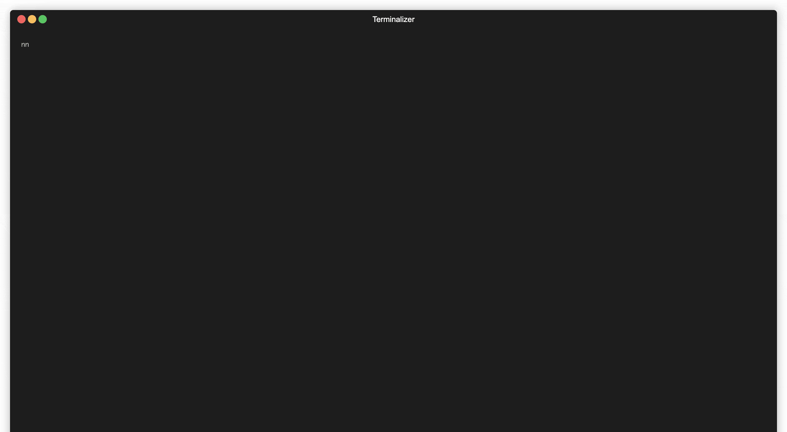

```
██████╗  ██████╗ ██╗  ██╗███████╗██████╗  █████╗ ██╗   ██╗
██╔══██╗██╔═══██╗██║ ██╔╝██╔════╝██╔══██╗██╔══██╗╚██╗ ██╔╝
██████╔╝██║   ██║█████╔╝ █████╗  ██████╔╝███████║ ╚████╔╝
██╔═══╝ ██║   ██║██╔═██╗ ██╔══╝  ██╔══██╗██╔══██║  ╚██╔╝
██║     ╚██████╔╝██║  ██╗███████╗██████╔╝██║  ██║   ██║
╚═╝      ╚═════╝ ╚═╝  ╚═╝╚══════╝╚═════╝ ╚═╝  ╚═╝   ╚═╝

```

Pokebay is an application that finds the cheapest Pokemon single-card listings on eBay using Integer Linear Programming (ILP) for combined shipping optimization.



## Features

- Fetches card data from the Pokemon TCG API.
- Fetches single-card listings from eBay.
- Uses ILP to find the optimal combination of listings to minimize total cost, including shipping.
- Exports the optimal solution to a CSV file.

## Prerequisites

- Node.js (v14 or higher)
- npm (v6 or higher)

## Installation

1. Clone the repository:

   ```sh
   git clone https://github.com/adamistheanswer/pokebay.git
   cd pokebay
   ```

2. Install the dependencies:

   ```sh
   npm install
   ```

3. Create a `.env` file in the root directory and add your API keys:
   ```env
   EBAY_BEARER_TOKEN=your_ebay_bearer_token
   POKEMON_TCG_API_KEY=your_pokemon_tcg_api_key
   ```

## Usage

1. Run the application:

   ```sh
   npm run start
   ```

2. The application will fetch card data and listings, solve the ILP model, and export the optimal solution to a CSV file in the `output` directory.

## Project Structure

- `index.mjs`: Main entry point of the application.
- `src/logger.mjs`: Logger setup using Winston.
- `src/config.mjs`: Configuration and environment variables.
- `src/pokemonApi.mjs`: Functions related to fetching data from the Pokemon TCG API.
- `src/ebayApi.mjs`: Functions related to fetching data from eBay.
- `src/ilpModel.mjs`: Functions related to building and solving the ILP model.
- `src/utils.mjs`: Utility functions.

## License

This project is licensed under the MIT License.
